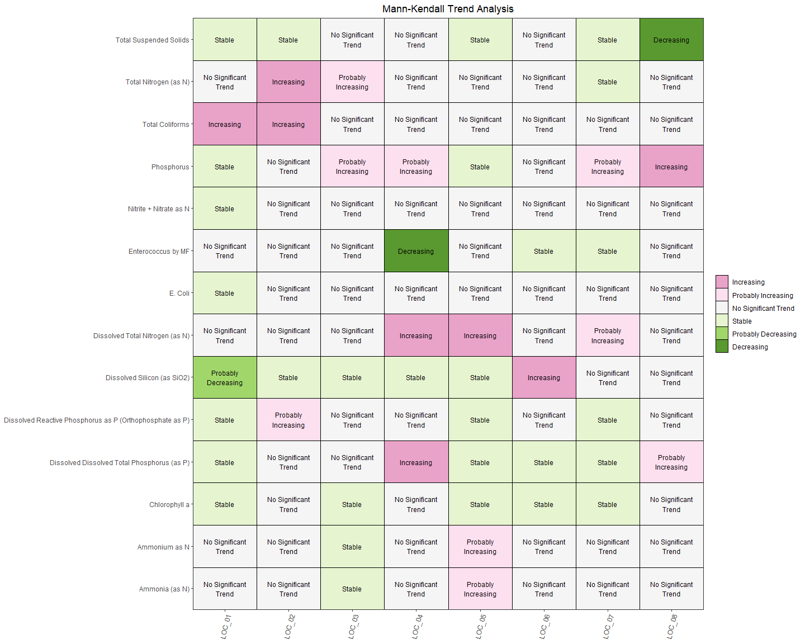

<!-- README.md is generated from README.Rmd. Please edit that file -->

# gRs

<!-- badges: start -->
<!-- badges: end -->

The goal of gRs is to process and analyse surfacewater and groundwater
data from esdat. Tha initial goal is to implement Mann-Kendall analysis
on an entire dataset at once and produce data visualisation of those
trends.

## Installation

You can install the development version of gRs from
[GitHub](https://github.com/) with:

``` r
# install.packages("devtools")
devtools::install_github("jenright-git/gRs")
```

## Example

This is a basic example which shows you how to solve a common problem:

Import data from an excel file exported directly from esdat.

``` r
library(gRs)

#import data
#gRs_data <- data_processor(("gRs_data.xlsx"))
## basic example code
```

Perform Mann-Kendall trend test

``` r
gRs::gRs_data %>% 
  mann_kendall_test() %>% 
  head(10) %>% 
  gt::gt()
```

<div id="cmxdurffkg" style="padding-left:0px;padding-right:0px;padding-top:10px;padding-bottom:10px;overflow-x:auto;overflow-y:auto;width:auto;height:auto;">
<style>#cmxdurffkg table {
  font-family: system-ui, 'Segoe UI', Roboto, Helvetica, Arial, sans-serif, 'Apple Color Emoji', 'Segoe UI Emoji', 'Segoe UI Symbol', 'Noto Color Emoji';
  -webkit-font-smoothing: antialiased;
  -moz-osx-font-smoothing: grayscale;
}
&#10;#cmxdurffkg thead, #cmxdurffkg tbody, #cmxdurffkg tfoot, #cmxdurffkg tr, #cmxdurffkg td, #cmxdurffkg th {
  border-style: none;
}
&#10;#cmxdurffkg p {
  margin: 0;
  padding: 0;
}
&#10;#cmxdurffkg .gt_table {
  display: table;
  border-collapse: collapse;
  line-height: normal;
  margin-left: auto;
  margin-right: auto;
  color: #333333;
  font-size: 16px;
  font-weight: normal;
  font-style: normal;
  background-color: #FFFFFF;
  width: auto;
  border-top-style: solid;
  border-top-width: 2px;
  border-top-color: #A8A8A8;
  border-right-style: none;
  border-right-width: 2px;
  border-right-color: #D3D3D3;
  border-bottom-style: solid;
  border-bottom-width: 2px;
  border-bottom-color: #A8A8A8;
  border-left-style: none;
  border-left-width: 2px;
  border-left-color: #D3D3D3;
}
&#10;#cmxdurffkg .gt_caption {
  padding-top: 4px;
  padding-bottom: 4px;
}
&#10;#cmxdurffkg .gt_title {
  color: #333333;
  font-size: 125%;
  font-weight: initial;
  padding-top: 4px;
  padding-bottom: 4px;
  padding-left: 5px;
  padding-right: 5px;
  border-bottom-color: #FFFFFF;
  border-bottom-width: 0;
}
&#10;#cmxdurffkg .gt_subtitle {
  color: #333333;
  font-size: 85%;
  font-weight: initial;
  padding-top: 3px;
  padding-bottom: 5px;
  padding-left: 5px;
  padding-right: 5px;
  border-top-color: #FFFFFF;
  border-top-width: 0;
}
&#10;#cmxdurffkg .gt_heading {
  background-color: #FFFFFF;
  text-align: center;
  border-bottom-color: #FFFFFF;
  border-left-style: none;
  border-left-width: 1px;
  border-left-color: #D3D3D3;
  border-right-style: none;
  border-right-width: 1px;
  border-right-color: #D3D3D3;
}
&#10;#cmxdurffkg .gt_bottom_border {
  border-bottom-style: solid;
  border-bottom-width: 2px;
  border-bottom-color: #D3D3D3;
}
&#10;#cmxdurffkg .gt_col_headings {
  border-top-style: solid;
  border-top-width: 2px;
  border-top-color: #D3D3D3;
  border-bottom-style: solid;
  border-bottom-width: 2px;
  border-bottom-color: #D3D3D3;
  border-left-style: none;
  border-left-width: 1px;
  border-left-color: #D3D3D3;
  border-right-style: none;
  border-right-width: 1px;
  border-right-color: #D3D3D3;
}
&#10;#cmxdurffkg .gt_col_heading {
  color: #333333;
  background-color: #FFFFFF;
  font-size: 100%;
  font-weight: normal;
  text-transform: inherit;
  border-left-style: none;
  border-left-width: 1px;
  border-left-color: #D3D3D3;
  border-right-style: none;
  border-right-width: 1px;
  border-right-color: #D3D3D3;
  vertical-align: bottom;
  padding-top: 5px;
  padding-bottom: 6px;
  padding-left: 5px;
  padding-right: 5px;
  overflow-x: hidden;
}
&#10;#cmxdurffkg .gt_column_spanner_outer {
  color: #333333;
  background-color: #FFFFFF;
  font-size: 100%;
  font-weight: normal;
  text-transform: inherit;
  padding-top: 0;
  padding-bottom: 0;
  padding-left: 4px;
  padding-right: 4px;
}
&#10;#cmxdurffkg .gt_column_spanner_outer:first-child {
  padding-left: 0;
}
&#10;#cmxdurffkg .gt_column_spanner_outer:last-child {
  padding-right: 0;
}
&#10;#cmxdurffkg .gt_column_spanner {
  border-bottom-style: solid;
  border-bottom-width: 2px;
  border-bottom-color: #D3D3D3;
  vertical-align: bottom;
  padding-top: 5px;
  padding-bottom: 5px;
  overflow-x: hidden;
  display: inline-block;
  width: 100%;
}
&#10;#cmxdurffkg .gt_spanner_row {
  border-bottom-style: hidden;
}
&#10;#cmxdurffkg .gt_group_heading {
  padding-top: 8px;
  padding-bottom: 8px;
  padding-left: 5px;
  padding-right: 5px;
  color: #333333;
  background-color: #FFFFFF;
  font-size: 100%;
  font-weight: initial;
  text-transform: inherit;
  border-top-style: solid;
  border-top-width: 2px;
  border-top-color: #D3D3D3;
  border-bottom-style: solid;
  border-bottom-width: 2px;
  border-bottom-color: #D3D3D3;
  border-left-style: none;
  border-left-width: 1px;
  border-left-color: #D3D3D3;
  border-right-style: none;
  border-right-width: 1px;
  border-right-color: #D3D3D3;
  vertical-align: middle;
  text-align: left;
}
&#10;#cmxdurffkg .gt_empty_group_heading {
  padding: 0.5px;
  color: #333333;
  background-color: #FFFFFF;
  font-size: 100%;
  font-weight: initial;
  border-top-style: solid;
  border-top-width: 2px;
  border-top-color: #D3D3D3;
  border-bottom-style: solid;
  border-bottom-width: 2px;
  border-bottom-color: #D3D3D3;
  vertical-align: middle;
}
&#10;#cmxdurffkg .gt_from_md > :first-child {
  margin-top: 0;
}
&#10;#cmxdurffkg .gt_from_md > :last-child {
  margin-bottom: 0;
}
&#10;#cmxdurffkg .gt_row {
  padding-top: 8px;
  padding-bottom: 8px;
  padding-left: 5px;
  padding-right: 5px;
  margin: 10px;
  border-top-style: solid;
  border-top-width: 1px;
  border-top-color: #D3D3D3;
  border-left-style: none;
  border-left-width: 1px;
  border-left-color: #D3D3D3;
  border-right-style: none;
  border-right-width: 1px;
  border-right-color: #D3D3D3;
  vertical-align: middle;
  overflow-x: hidden;
}
&#10;#cmxdurffkg .gt_stub {
  color: #333333;
  background-color: #FFFFFF;
  font-size: 100%;
  font-weight: initial;
  text-transform: inherit;
  border-right-style: solid;
  border-right-width: 2px;
  border-right-color: #D3D3D3;
  padding-left: 5px;
  padding-right: 5px;
}
&#10;#cmxdurffkg .gt_stub_row_group {
  color: #333333;
  background-color: #FFFFFF;
  font-size: 100%;
  font-weight: initial;
  text-transform: inherit;
  border-right-style: solid;
  border-right-width: 2px;
  border-right-color: #D3D3D3;
  padding-left: 5px;
  padding-right: 5px;
  vertical-align: top;
}
&#10;#cmxdurffkg .gt_row_group_first td {
  border-top-width: 2px;
}
&#10;#cmxdurffkg .gt_row_group_first th {
  border-top-width: 2px;
}
&#10;#cmxdurffkg .gt_summary_row {
  color: #333333;
  background-color: #FFFFFF;
  text-transform: inherit;
  padding-top: 8px;
  padding-bottom: 8px;
  padding-left: 5px;
  padding-right: 5px;
}
&#10;#cmxdurffkg .gt_first_summary_row {
  border-top-style: solid;
  border-top-color: #D3D3D3;
}
&#10;#cmxdurffkg .gt_first_summary_row.thick {
  border-top-width: 2px;
}
&#10;#cmxdurffkg .gt_last_summary_row {
  padding-top: 8px;
  padding-bottom: 8px;
  padding-left: 5px;
  padding-right: 5px;
  border-bottom-style: solid;
  border-bottom-width: 2px;
  border-bottom-color: #D3D3D3;
}
&#10;#cmxdurffkg .gt_grand_summary_row {
  color: #333333;
  background-color: #FFFFFF;
  text-transform: inherit;
  padding-top: 8px;
  padding-bottom: 8px;
  padding-left: 5px;
  padding-right: 5px;
}
&#10;#cmxdurffkg .gt_first_grand_summary_row {
  padding-top: 8px;
  padding-bottom: 8px;
  padding-left: 5px;
  padding-right: 5px;
  border-top-style: double;
  border-top-width: 6px;
  border-top-color: #D3D3D3;
}
&#10;#cmxdurffkg .gt_last_grand_summary_row_top {
  padding-top: 8px;
  padding-bottom: 8px;
  padding-left: 5px;
  padding-right: 5px;
  border-bottom-style: double;
  border-bottom-width: 6px;
  border-bottom-color: #D3D3D3;
}
&#10;#cmxdurffkg .gt_striped {
  background-color: rgba(128, 128, 128, 0.05);
}
&#10;#cmxdurffkg .gt_table_body {
  border-top-style: solid;
  border-top-width: 2px;
  border-top-color: #D3D3D3;
  border-bottom-style: solid;
  border-bottom-width: 2px;
  border-bottom-color: #D3D3D3;
}
&#10;#cmxdurffkg .gt_footnotes {
  color: #333333;
  background-color: #FFFFFF;
  border-bottom-style: none;
  border-bottom-width: 2px;
  border-bottom-color: #D3D3D3;
  border-left-style: none;
  border-left-width: 2px;
  border-left-color: #D3D3D3;
  border-right-style: none;
  border-right-width: 2px;
  border-right-color: #D3D3D3;
}
&#10;#cmxdurffkg .gt_footnote {
  margin: 0px;
  font-size: 90%;
  padding-top: 4px;
  padding-bottom: 4px;
  padding-left: 5px;
  padding-right: 5px;
}
&#10;#cmxdurffkg .gt_sourcenotes {
  color: #333333;
  background-color: #FFFFFF;
  border-bottom-style: none;
  border-bottom-width: 2px;
  border-bottom-color: #D3D3D3;
  border-left-style: none;
  border-left-width: 2px;
  border-left-color: #D3D3D3;
  border-right-style: none;
  border-right-width: 2px;
  border-right-color: #D3D3D3;
}
&#10;#cmxdurffkg .gt_sourcenote {
  font-size: 90%;
  padding-top: 4px;
  padding-bottom: 4px;
  padding-left: 5px;
  padding-right: 5px;
}
&#10;#cmxdurffkg .gt_left {
  text-align: left;
}
&#10;#cmxdurffkg .gt_center {
  text-align: center;
}
&#10;#cmxdurffkg .gt_right {
  text-align: right;
  font-variant-numeric: tabular-nums;
}
&#10;#cmxdurffkg .gt_font_normal {
  font-weight: normal;
}
&#10;#cmxdurffkg .gt_font_bold {
  font-weight: bold;
}
&#10;#cmxdurffkg .gt_font_italic {
  font-style: italic;
}
&#10;#cmxdurffkg .gt_super {
  font-size: 65%;
}
&#10;#cmxdurffkg .gt_footnote_marks {
  font-size: 75%;
  vertical-align: 0.4em;
  position: initial;
}
&#10;#cmxdurffkg .gt_asterisk {
  font-size: 100%;
  vertical-align: 0;
}
&#10;#cmxdurffkg .gt_indent_1 {
  text-indent: 5px;
}
&#10;#cmxdurffkg .gt_indent_2 {
  text-indent: 10px;
}
&#10;#cmxdurffkg .gt_indent_3 {
  text-indent: 15px;
}
&#10;#cmxdurffkg .gt_indent_4 {
  text-indent: 20px;
}
&#10;#cmxdurffkg .gt_indent_5 {
  text-indent: 25px;
}
</style>
<table class="gt_table" data-quarto-disable-processing="false" data-quarto-bootstrap="false">
  <thead>
    &#10;    <tr class="gt_col_headings">
      <th class="gt_col_heading gt_columns_bottom_border gt_left" rowspan="1" colspan="1" scope="col" id="location_code">location_code</th>
      <th class="gt_col_heading gt_columns_bottom_border gt_left" rowspan="1" colspan="1" scope="col" id="chem_name">chem_name</th>
      <th class="gt_col_heading gt_columns_bottom_border gt_right" rowspan="1" colspan="1" scope="col" id="p_value">p_value</th>
      <th class="gt_col_heading gt_columns_bottom_border gt_right" rowspan="1" colspan="1" scope="col" id="tau_statistic">tau_statistic</th>
      <th class="gt_col_heading gt_columns_bottom_border gt_right" rowspan="1" colspan="1" scope="col" id="sample_mean">sample_mean</th>
      <th class="gt_col_heading gt_columns_bottom_border gt_right" rowspan="1" colspan="1" scope="col" id="SD">SD</th>
      <th class="gt_col_heading gt_columns_bottom_border gt_right" rowspan="1" colspan="1" scope="col" id="COV">COV</th>
      <th class="gt_col_heading gt_columns_bottom_border gt_left" rowspan="1" colspan="1" scope="col" id="trend">trend</th>
    </tr>
  </thead>
  <tbody class="gt_table_body">
    <tr><td headers="location_code" class="gt_row gt_left">LOC_01</td>
<td headers="chem_name" class="gt_row gt_left">Phosphorus</td>
<td headers="p_value" class="gt_row gt_right">0.81328621</td>
<td headers="tau_statistic" class="gt_row gt_right">-0.07479576</td>
<td headers="sample_mean" class="gt_row gt_right">1.618182e-02</td>
<td headers="SD" class="gt_row gt_right">4.556713e-03</td>
<td headers="COV" class="gt_row gt_right">0.2815946</td>
<td headers="trend" class="gt_row gt_left">Stable</td></tr>
    <tr><td headers="location_code" class="gt_row gt_left">LOC_01</td>
<td headers="chem_name" class="gt_row gt_left">Total Nitrogen (as N)</td>
<td headers="p_value" class="gt_row gt_right">0.15857842</td>
<td headers="tau_statistic" class="gt_row gt_right">0.35191220</td>
<td headers="sample_mean" class="gt_row gt_right">1.300000e-01</td>
<td headers="SD" class="gt_row gt_right">4.774935e-02</td>
<td headers="COV" class="gt_row gt_right">0.3673027</td>
<td headers="trend" class="gt_row gt_left">No Significant Trend</td></tr>
    <tr><td headers="location_code" class="gt_row gt_left">LOC_01</td>
<td headers="chem_name" class="gt_row gt_left">Total Coliforms</td>
<td headers="p_value" class="gt_row gt_right">0.02354218</td>
<td headers="tau_statistic" class="gt_row gt_right">0.55048188</td>
<td headers="sample_mean" class="gt_row gt_right">8.123636e+02</td>
<td headers="SD" class="gt_row gt_right">1.323262e+03</td>
<td headers="COV" class="gt_row gt_right">1.6289031</td>
<td headers="trend" class="gt_row gt_left">Increasing</td></tr>
    <tr><td headers="location_code" class="gt_row gt_left">LOC_01</td>
<td headers="chem_name" class="gt_row gt_left">Dissolved Total Nitrogen (as N)</td>
<td headers="p_value" class="gt_row gt_right">0.69384100</td>
<td headers="tau_statistic" class="gt_row gt_right">0.11219364</td>
<td headers="sample_mean" class="gt_row gt_right">1.263636e-01</td>
<td headers="SD" class="gt_row gt_right">4.522670e-02</td>
<td headers="COV" class="gt_row gt_right">0.3579092</td>
<td headers="trend" class="gt_row gt_left">No Significant Trend</td></tr>
    <tr><td headers="location_code" class="gt_row gt_left">LOC_01</td>
<td headers="chem_name" class="gt_row gt_left">Dissolved Dissolved Total Phosphorus (as P)</td>
<td headers="p_value" class="gt_row gt_right">0.57919899</td>
<td headers="tau_statistic" class="gt_row gt_right">-0.15255401</td>
<td headers="sample_mean" class="gt_row gt_right">1.245455e-02</td>
<td headers="SD" class="gt_row gt_right">2.805838e-03</td>
<td headers="COV" class="gt_row gt_right">0.2252863</td>
<td headers="trend" class="gt_row gt_left">Stable</td></tr>
    <tr><td headers="location_code" class="gt_row gt_left">LOC_01</td>
<td headers="chem_name" class="gt_row gt_left">Ammonia (as N)</td>
<td headers="p_value" class="gt_row gt_right">0.27283176</td>
<td headers="tau_statistic" class="gt_row gt_right">0.27782542</td>
<td headers="sample_mean" class="gt_row gt_right">1.109091e-02</td>
<td headers="SD" class="gt_row gt_right">4.908249e-03</td>
<td headers="COV" class="gt_row gt_right">0.4425470</td>
<td headers="trend" class="gt_row gt_left">No Significant Trend</td></tr>
    <tr><td headers="location_code" class="gt_row gt_left">LOC_01</td>
<td headers="chem_name" class="gt_row gt_left">Dissolved Reactive Phosphorus as P (Orthophosphate as P)</td>
<td headers="p_value" class="gt_row gt_right">0.33407284</td>
<td headers="tau_statistic" class="gt_row gt_right">-0.25568961</td>
<td headers="sample_mean" class="gt_row gt_right">8.727273e-03</td>
<td headers="SD" class="gt_row gt_right">2.572583e-03</td>
<td headers="COV" class="gt_row gt_right">0.2947751</td>
<td headers="trend" class="gt_row gt_left">Stable</td></tr>
    <tr><td headers="location_code" class="gt_row gt_left">LOC_01</td>
<td headers="chem_name" class="gt_row gt_left">Enterococcus by MF</td>
<td headers="p_value" class="gt_row gt_right">0.53091599</td>
<td headers="tau_statistic" class="gt_row gt_right">0.16669525</td>
<td headers="sample_mean" class="gt_row gt_right">1.545455e+01</td>
<td headers="SD" class="gt_row gt_right">1.504236e+01</td>
<td headers="COV" class="gt_row gt_right">0.9733295</td>
<td headers="trend" class="gt_row gt_left">No Significant Trend</td></tr>
    <tr><td headers="location_code" class="gt_row gt_left">LOC_01</td>
<td headers="chem_name" class="gt_row gt_left">Nitrite + Nitrate as N</td>
<td headers="p_value" class="gt_row gt_right">0.18435095</td>
<td headers="tau_statistic" class="gt_row gt_right">-0.33028913</td>
<td headers="sample_mean" class="gt_row gt_right">1.363636e-02</td>
<td headers="SD" class="gt_row gt_right">1.243602e-02</td>
<td headers="COV" class="gt_row gt_right">0.9119747</td>
<td headers="trend" class="gt_row gt_left">Stable</td></tr>
    <tr><td headers="location_code" class="gt_row gt_left">LOC_01</td>
<td headers="chem_name" class="gt_row gt_left">Total Suspended Solids</td>
<td headers="p_value" class="gt_row gt_right">0.13908673</td>
<td headers="tau_statistic" class="gt_row gt_right">-0.41170556</td>
<td headers="sample_mean" class="gt_row gt_right">1.636364e+00</td>
<td headers="SD" class="gt_row gt_right">1.206045e+00</td>
<td headers="COV" class="gt_row gt_right">0.7370277</td>
<td headers="trend" class="gt_row gt_left">Stable</td></tr>
  </tbody>
  &#10;  
</table>
</div>

``` r
gRs::gRs_data %>% 
  mann_kendall_test() %>% 
  mann_kendall_heatmap()
```


