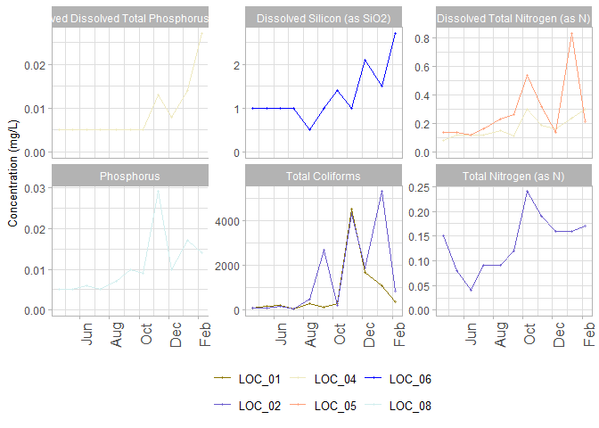

<!-- README.md is generated from README.Rmd. Please edit that file -->

# gRs

<!-- badges: start -->
<!-- badges: end -->

The goal of gRs is to process and analyse surface water and groundwater
data from esdat. Tha initial goal is to implement Mann-Kendall analysis
on an entire dataset at once and produce data visualisation of those
trends.

## Installation

You can install the development version of gRs from
[GitHub](https://github.com/) with:

``` r
# install.packages("devtools")
devtools::install_github("jenright-git/gRs")
```

## Example

This is a basic example which shows you how to solve a common problem:

Import data from an excel file exported directly from esdat.

``` r
library(gRs)
library(tidyverse)

establish_plotting_variables(gRs::gRs_data)

#import data
#gRs_data <- data_processor(("gRs_data.xlsx"))
```

Perform Mann-Kendall trend test

``` r
gRs::gRs_data %>% 
  gRs::mann_kendall_test() %>% 
  select(-data) %>% 
  head(5)
#> # A tibble: 5 × 8
#>   location_code chem_name  p_value tau_statistic sample_mean      SD   COV trend
#>   <chr>         <chr>        <dbl>         <dbl>       <dbl>   <dbl> <dbl> <chr>
#> 1 LOC_01        Phosphorus  0.813        -0.0748      0.0162 0.00456 0.282 Stab…
#> 2 LOC_02        Phosphorus  0.482         0.183       0.0175 0.00646 0.370 No S…
#> 3 LOC_03        Phosphorus  0.0725        0.440       0.024  0.0144  0.600 Prob…
#> 4 LOC_04        Phosphorus  0.0785        0.443       0.0109 0.00769 0.705 Prob…
#> 5 LOC_05        Phosphorus  0.522        -0.173       0.0107 0.00825 0.769 Stab…
```

Visualise trends with a heatmap

``` r
gRs::gRs_data %>% 
  mann_kendall_test() %>% 
  mann_kendall_heatmap(width=18)
```


Plot the increasing trends.

``` r
gRs::gRs_data %>% 
  mann_kendall_test() %>% 
  filter(trend == "Increasing") %>% 
  unnest(data) %>% 
  timeseries_plot(date_break = "2 month", date_label = "%b")+
  facet_wrap(~chem_name, scales="free_y")
```


