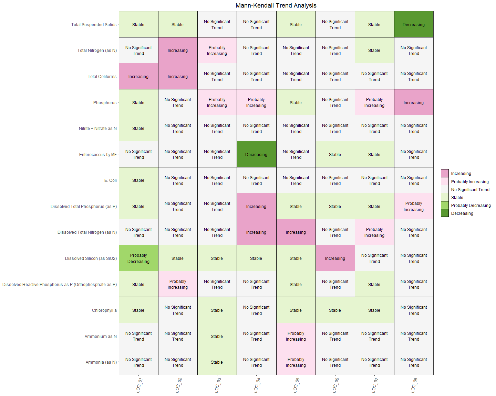
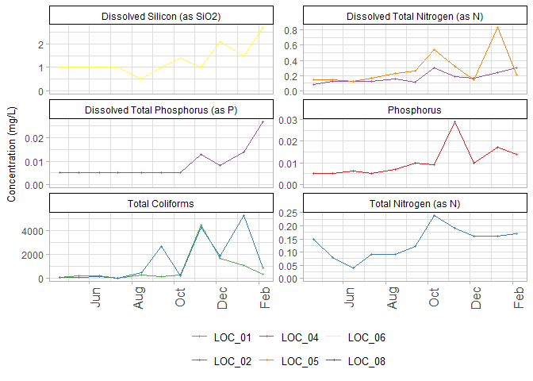
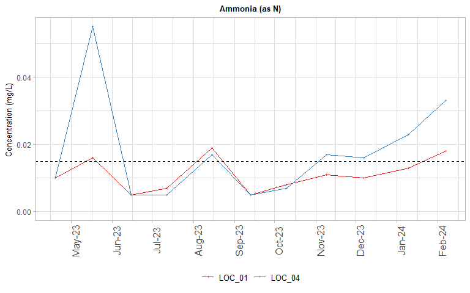

<!-- README.md is generated from README.Rmd. Please edit that file -->

# gRs

<!-- badges: start -->

<!-- badges: end -->

An R package for reading, analysing and visualising esdat and EQuIS environmental data.

## Installation

``` r
# install.packages("devtools")
devtools::install_github("jenright-git/gRs")
```

## Reading data

`data_processor()` reads excel exports from the esdat data view or grid reports from EQuIS. These include soil and water chemistry as well as water level exports.

``` r
chem <- data_processor("davLChem1_Chemistry.xlsx")
```

`action_level_processor()` reads an esdat action level export.

``` r
al <- action_level_processor("ANZG 95 Marine.xlsx", name = "ANZG 95% Marine")
```

`gRs_data` is bundled example data, in the shape `data_processor()` returns.

``` r
library(gRs)
library(dplyr)
library(gt)

gRs_data |>
  select(date, monitoring_round, location_code, chem_name, prefix,
         concentration, output_unit, detect_flag) |>
  head(6) 
#> # A tibble: 6 × 8
#>   date                monitoring_round location_code chem_name  prefix
#>   <dttm>              <chr>            <chr>         <chr>      <chr> 
#> 1 2023-04-19 00:00:00 2023-04          LOC_01        Phosphorus <NA>  
#> 2 2023-04-19 00:00:00 2023-04          LOC_02        Phosphorus <NA>  
#> 3 2023-04-19 00:00:00 2023-04          LOC_03        Phosphorus <NA>  
#> 4 2023-04-19 00:00:00 2023-04          LOC_04        Phosphorus <NA>  
#> 5 2023-04-19 00:00:00 2023-04          LOC_05        Phosphorus <NA>  
#> 6 2023-04-19 00:00:00 2023-04          LOC_06        Phosphorus <NA>  
#> # ℹ 3 more variables: concentration <dbl>, output_unit <chr>, detect_flag <chr>
```

## Preparing results

`select_max_concentration()` collapses field and interlab duplicates to the highest result.

``` r
chem <- select_max_concentration(chem)
```

`half_lor()` substitutes a fraction of the LOR for every non-detect.

``` r
gRs_data |>
  filter(chem_name == "Chlorophyll a", !is.na(prefix)) |>
  half_lor(lor_multiplier = 0.5) |>
  select(date, location_code, prefix, concentration, detect_flag) |>
  head(4) 
#> # A tibble: 4 × 5
#>   date                location_code prefix concentration detect_flag
#>   <dttm>              <chr>         <chr>          <dbl> <chr>      
#> 1 2023-04-19 00:00:00 LOC_01        <             0.0005 N          
#> 2 2023-04-19 00:00:00 LOC_02        <             0.0005 N          
#> 3 2023-05-17 00:00:00 LOC_01        <             0.0005 N          
#> 4 2023-05-17 00:00:00 LOC_02        <             0.0005 N
```

`join_action_levels()` puts a guideline against every result and flags the exceedances.

``` r
compared <- join_action_levels(gRs_data, al, match_matrix = FALSE)

compared |>
  filter(chem_name == "Chlorophyll a") |>
  select(location_code, date, concentration, output_unit,
         criteria, exceedance_ratio, exceedance) |>
  head(4) 
#> # A tibble: 4 × 7
#>   location_code date                concentration output_unit criteria
#>   <chr>         <dttm>                      <dbl> <chr>          <dbl>
#> 1 LOC_01        2023-04-19 00:00:00         0.001 mg/L           0.004
#> 2 LOC_02        2023-04-19 00:00:00         0.001 mg/L           0.004
#> 3 LOC_03        2023-04-19 00:00:00         0.003 mg/L           0.004
#> 4 LOC_04        2023-04-19 00:00:00         0.002 mg/L           0.004
#> # ℹ 2 more variables: exceedance_ratio <dbl>, exceedance <lgl>
```

## Summary tables

`analyte_summary()` summarises a monitoring round, one row per analyte, and `create_gt()` formats it for a report.

``` r
analyte_summary(compared, quiet = TRUE) 
#> # A tibble: 14 × 14
#>    chem_name     output_unit n_samples n_detects pct_detects min_prefix min_conc
#>    <chr>         <chr>           <int>     <int>       <dbl> <chr>         <dbl>
#>  1 Ammonia (as … mg/L                8         5        62.5 <             0.005
#>  2 Ammonium as N mg/L                8         5        62.5 <             0.005
#>  3 Chlorophyll a mg/L                8         4        50   <             0.001
#>  4 Dissolved Re… mg/L                8         7        87.5 <             0.001
#>  5 Dissolved Si… mg/L                8         7        87.5 <             1    
#>  6 Dissolved To… mg/L                8         8       100   <NA>          0.12 
#>  7 Dissolved To… mg/L                8         6        75   <             0.005
#>  8 E. Coli       CFU/100mL           8         7        87.5 <NA>          8    
#>  9 Enterococcus… cfu/100 mL          8         7        87.5 <NA>          2    
#> 10 Nitrite + Ni… mg/L                8         8       100   <NA>          0.007
#> 11 Phosphorus    mg/L                8         8       100   <NA>          0.012
#> 12 Total Colifo… CFU/100mL           8         8       100   <NA>         50    
#> 13 Total Nitrog… mg/L                8         8       100   <NA>          0.15 
#> 14 Total Suspen… mg/L                8         7        87.5 <NA>          1    
#> # ℹ 7 more variables: max_prefix <chr>, max_conc <dbl>, max_location <chr>,
#> #   criteria <dbl>, n_exceedances <int>, n_exceedance_locations <int>,
#> #   exceedance_locations <chr>
```

`exceedance_summary()` returns the results behind those exceedance counts.

``` r
exceedance_summary(compared, quiet = TRUE) |>
  select(location_code, chem_name, concentration, output_unit,
         criteria, exceedance_ratio) |>
  head(8)
#> # A tibble: 8 × 6
#>   location_code chem_name    concentration output_unit criteria exceedance_ratio
#>   <chr>         <chr>                <dbl> <chr>          <dbl>            <dbl>
#> 1 LOC_04        Ammonia (as…         0.033 mg/L           0.015             2.2 
#> 2 LOC_05        Ammonia (as…         0.029 mg/L           0.015             1.93
#> 3 LOC_01        Ammonia (as…         0.018 mg/L           0.015             1.2 
#> 4 LOC_03        Chlorophyll…         0.005 mg/L           0.004             1.25
#> 5 LOC_03        Dissolved R…         0.023 mg/L           0.005             4.6 
#> 6 LOC_04        Dissolved R…         0.016 mg/L           0.005             3.2 
#> 7 LOC_02        Dissolved R…         0.01  mg/L           0.005             2   
#> 8 LOC_01        Dissolved R…         0.008 mg/L           0.005             1.6
```

`min_max_locations()` returns the highest and lowest result for each analyte, with its location.

``` r
min_max_locations(gRs_data, n_max = 1, n_min = 1, quiet = TRUE) |>
  select(chem_name, extreme, location_code, prefix,
         concentration, output_unit) |>
  head(8) 
#> # A tibble: 8 × 6
#>   chem_name               extreme location_code prefix concentration output_unit
#>   <chr>                   <chr>   <chr>         <chr>          <dbl> <chr>      
#> 1 Ammonia (as N)          Maximum LOC_04        <NA>           0.033 mg/L       
#> 2 Ammonia (as N)          Minimum LOC_03        <              0.005 mg/L       
#> 3 Ammonium as N           Maximum LOC_04        <NA>           0.032 mg/L       
#> 4 Ammonium as N           Minimum LOC_03        <              0.005 mg/L       
#> 5 Chlorophyll a           Maximum LOC_03        <NA>           0.005 mg/L       
#> 6 Chlorophyll a           Minimum LOC_01        <              0.001 mg/L       
#> 7 Dissolved Reactive Pho… Maximum LOC_03        <NA>           0.023 mg/L       
#> 8 Dissolved Reactive Pho… Minimum LOC_07        <              0.001 mg/L
```

`summary_stats()` summarises the whole record, one row per location and analyte.

``` r
summary_stats(compared, include_criteria = TRUE) |>
  filter(chem_name == "Ammonia (as N)") |>
  select(location_code, n_samples, n_detects, pct_detects,
         min, mean, max, p95, criteria, exceedance_count) 
#> # A tibble: 8 × 10
#>   location_code n_samples n_detects pct_detects   min   mean   max    p95
#>   <chr>             <int>     <int>       <dbl> <dbl>  <dbl> <dbl>  <dbl>
#> 1 LOC_01               11         9        81.8 0.005 0.0111 0.019 0.0185
#> 2 LOC_02               11        10        90.9 0.005 0.0487 0.382 0.224 
#> 3 LOC_03               11        10        90.9 0.005 0.015  0.031 0.0305
#> 4 LOC_04               11         8        72.7 0.005 0.0175 0.055 0.044 
#> 5 LOC_05               11        11       100   0.009 0.0805 0.285 0.27  
#> 6 LOC_06               11         8        72.7 0.005 0.0159 0.048 0.0395
#> 7 LOC_07               11         6        54.5 0.005 0.0152 0.059 0.0425
#> 8 LOC_08               11         3        27.3 0.005 0.0115 0.068 0.039 
#> # ℹ 2 more variables: criteria <dbl>, exceedance_count <int>
```

## Historical range

`historical_range()` compares the latest round against the record behind it, one row per location and analyte.

``` r
compared |>
  filter(chem_name == "Phosphorus") |>
  historical_range(quiet = TRUE) 
#> # A tibble: 8 × 17
#>   location_code chem_name  output_unit n_samples n_current hist_min_prefix
#>   <chr>         <chr>      <chr>           <int>     <int> <chr>          
#> 1 LOC_01        Phosphorus mg/L               11         1 <NA>           
#> 2 LOC_02        Phosphorus mg/L               11         1 <NA>           
#> 3 LOC_03        Phosphorus mg/L               11         1 <NA>           
#> 4 LOC_04        Phosphorus mg/L               11         1 <NA>           
#> 5 LOC_05        Phosphorus mg/L               11         1 <              
#> 6 LOC_06        Phosphorus mg/L               11         1 <              
#> 7 LOC_07        Phosphorus mg/L               11         1 <NA>           
#> 8 LOC_08        Phosphorus mg/L               11         1 <              
#> # ℹ 11 more variables: hist_min_conc <dbl>, hist_max_prefix <chr>,
#> #   hist_max_conc <dbl>, current_prefix <chr>, current_conc <dbl>,
#> #   new_max <lgl>, new_min <lgl>, max_ratio <dbl>, spike <lgl>, criteria <dbl>,
#> #   current_exceedance <lgl>
```

`keep = "new_max"` cuts it to the results that set a new maximum.

``` r
historical_range(compared, keep = "new_max", quiet = TRUE) |>
  select(chem_name, location_code, hist_max_prefix, hist_max_conc,
         current_prefix, current_conc) 
#> # A tibble: 13 × 6
#>    chem_name          location_code hist_max_prefix hist_max_conc current_prefix
#>    <chr>              <chr>         <chr>                   <dbl> <chr>         
#>  1 Total Coliforms    LOC_07        <NA>                   20     <NA>          
#>  2 Dissolved Reactiv… LOC_03        <NA>                    0.009 <NA>          
#>  3 Dissolved Reactiv… LOC_04        <NA>                    0.008 <NA>          
#>  4 Dissolved Total P… LOC_04        <NA>                    0.014 <NA>          
#>  5 Dissolved Total P… LOC_03        <NA>                    0.021 <NA>          
#>  6 Dissolved Silicon… LOC_07        <NA>                    2.4   <NA>          
#>  7 Dissolved Reactiv… LOC_05        <NA>                    0.005 <NA>          
#>  8 Phosphorus         LOC_07        <NA>                    0.009 <NA>          
#>  9 Dissolved Silicon… LOC_06        <NA>                    2.1   <NA>          
#> 10 Nitrite + Nitrate… LOC_06        <NA>                    0.017 <NA>          
#> 11 Phosphorus         LOC_03        <NA>                    0.042 <NA>          
#> 12 E. Coli            LOC_04        <NA>                   25     <NA>          
#> 13 Dissolved Total N… LOC_06        <NA>                    0.2   <NA>          
#> # ℹ 1 more variable: current_conc <dbl>
```

## Trend analysis

`mann_kendall_test()` runs a Mann-Kendall test on every location and analyte at once.

``` r
trends <- mann_kendall_test(gRs_data)

trends |>
  select(location_code, chem_name, p_value, tau_statistic, trend) |>
  head(5) 
#> # A tibble: 5 × 5
#>   location_code chem_name  p_value tau_statistic trend               
#>   <chr>         <chr>        <dbl>         <dbl> <chr>               
#> 1 LOC_01        Phosphorus  0.813        -0.0748 Stable              
#> 2 LOC_02        Phosphorus  0.482         0.183  No Significant Trend
#> 3 LOC_03        Phosphorus  0.0725        0.440  Probably Increasing 
#> 4 LOC_04        Phosphorus  0.0785        0.443  Probably Increasing 
#> 5 LOC_05        Phosphorus  0.522        -0.173  Stable
```

`mann_kendall_heatmap()` plots the whole grid.

``` r
mann_kendall_heatmap(trends, width = 18)
```



`mka_to_excel()` writes the same grid to a formatted workbook - analytes across the top, trends in the cells, coloured by direction - with a second sheet explaining the categories.

``` r
mka_to_excel(trends, save_path = "output/MKA Trend Summary.xlsx")

# Recolour one category and leave the rest alone
mka_to_excel(trends, trend_colours = c(Increasing = "#E06666"))
```

## Plotting

`timeseries_plot()` facets by analyte and colours by location.

``` r
library(tidyr)

trends |>
  filter(trend == "Increasing") |>
  unnest(data) |>
  timeseries_plot(date_break = "2 month", date_label = "%b")
```



One analyte at two locations, with `criteria_col` drawing the guideline.

``` r
compared |>
  timeseries_plot(
    filter_analyte = "Ammonia (as N)",
    filter_location = c("LOC_01", "LOC_04"),
    criteria_col = criteria,
    date_break = "1 month",
    date_label = "%b-%y",
    plot_title = "Ammonia (as N)"
  )
```



Full documentation for every function is at <https://jenright-git.github.io/gRs/>.