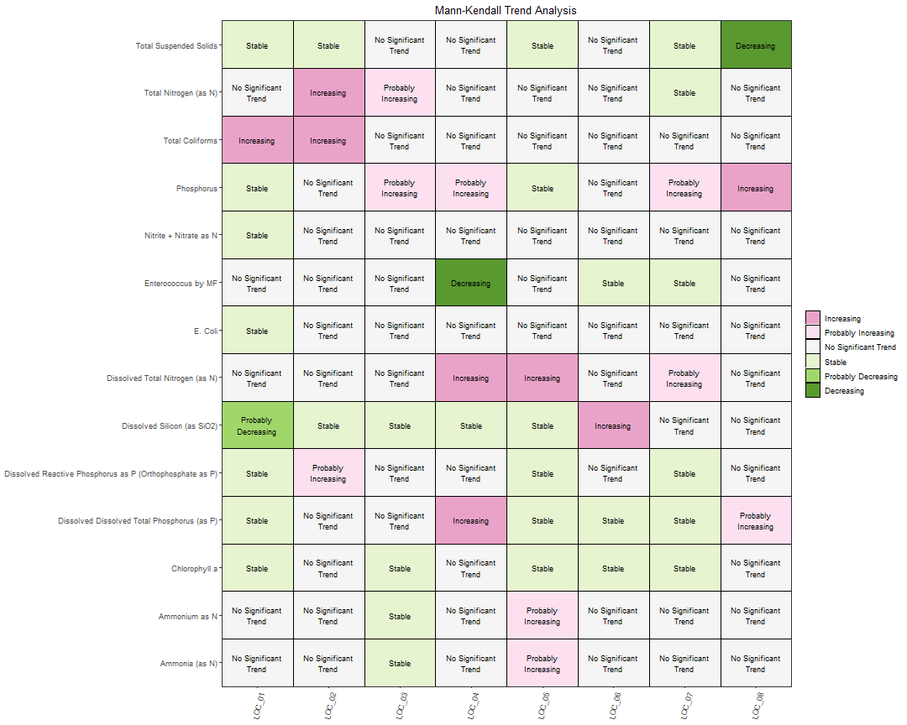
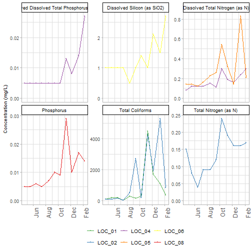

<!-- README.md is generated from README.Rmd. Please edit that file -->


# gRs

<!-- badges: start -->
<!-- badges: end -->

The goal of gRs is to process and analyse surface water, groundwater and soil/sediment data from esdat and EQuIS.
Tha initial goal is to implement Mann-Kendall analysis on an entire dataset at once and produce data visualisation of those trends.

`data_processor()` reads chemistry exports (EQuIS Analytical Results II, esdat `LChem1_Chemistry` for liquids and `SChem1_Chemistry` for soils, and esdat `Chemistry List`) and gauging reports (EQuIS `Water Levels II` and esdat gauging reports), normalising each to a shared set of column names. The format is detected from the worksheet contents, so no extra arguments are needed.

Soil exports report each analyte twice - once as a solid-phase concentration (mg/kg) and once as a leachate concentration (mg/L or ug/L). Only the solid-phase results are returned by default; pass `result_type = "LEACHED_REG"` for the leachate results, or `result_type = "all"` for both.

`action_level_processor()` reads an esdat action level export - a guideline set such as the ANZG marine water toxicant DGVs - and `join_action_levels()` puts a guideline against every result so the two can be compared. The export carries no column naming the guideline set, so the name is supplied by `name`:

``` r
chem <- data_processor("davLChem1_Chemistry.xlsx")
anzg <- action_level_processor("ANZG Marine Water Toxicant DGVs LOSP 95.xlsx",
                               name = "ANZG 95% Marine")

compared <- join_action_levels(chem, anzg)
#> Matched 1335 of 10086 results to ANZG 95% Marine (chem_code: 1335).
```

Analytes are matched on `chem_code` - the CAS number, which identifies the analyte and is never trimmed, stripped or otherwise reduced to force a join. A suffixed code names a different analyte from the bare code, so `91-20-3` and `91-20-3_VOC` keep their separate guidelines and neither stands in for the other. Where a result carries no code, `chem_name` is tried instead, which is what matches an EQuIS export reporting names against codes the guideline set does not share. Anything that finds no guideline is returned as `attr(compared, "unmatched")` rather than being matched approximately.

A guideline is only put against a result it applies to. The matrix must agree, a filtered (dissolved) result only takes a guideline flagged `filtered` and a total result one flagged `total`, a leachate result only one flagged `leached`, and the guideline is converted into the unit the result was reported in - so a µg/L guideline lands as mg/L against a result reported in mg/L, and a mg/kg guideline is never compared against a water result at all.

A guideline carrying no unit is never joined and never assumed to share the result's unit - a missing unit is a fault in the guideline file, and `action_level_processor()` says so when it reads one. Fix it there.

Only a detected result exceeds a guideline. A non-detect whose LOR sits above the guideline is recorded separately in `lor_above_criteria`; pass `lor_as_exceedance = TRUE` to count those as exceedances too. That choice is made once, at the join, and everything reading `exceedance` afterwards follows it:

``` r
compared <- join_action_levels(chem, anzg, lor_as_exceedance = TRUE)
```

The added `criteria` column is the one the rest of the package already reads:

``` r
summary_stats(compared, include_criteria = TRUE)
timeseries_plot(compared, criteria_col = criteria)
```

To compare against more than one guideline set, join them one at a time into their own columns with `value_col`, then stack them into a single `criteria` column with `criteria_long()` when it is time to analyse across sets:

``` r
compared <- chem %>%
  join_action_levels(anzg_95) %>%
  join_action_levels(anzg_99, value_col = "criteria_99")

criteria_long(compared) %>%
  group_by(criteria_set, chem_name) %>%
  summarise(exceedances = sum(exceedance, na.rm = TRUE))
```

## Installation

You can install the development version of gRs from [GitHub](https://github.com/) with:

``` r
# install.packages("devtools")
devtools::install_github("jenright-git/gRs")
```

## Example

This is a basic example which shows you how to solve a common problem:

Import data from an excel file exported directly from esdat.


``` r
library(gRs)
library(tidyverse)

establish_plotting_variables(gRs::gRs_data)

#import data
#gRs_data <- data_processor(("gRs_data.xlsx"))

```

Perform Mann-Kendall trend test

``` r
gRs::gRs_data %>% 
  gRs::mann_kendall_test() %>% 
  select(-data) %>% 
  head(5)
#> # A tibble: 5 × 9
#>   location_code chem_name  p_value tau_statistic S_statistic sample_mean      SD
#>   <chr>         <chr>        <dbl>         <dbl>       <dbl>       <dbl>   <dbl>
#> 1 LOC_01        Phosphorus  0.813        -0.0748          -4      0.0162 0.00456
#> 2 LOC_02        Phosphorus  0.482         0.183           10      0.0175 0.00646
#> 3 LOC_03        Phosphorus  0.0725        0.440           24      0.024  0.0144 
#> 4 LOC_04        Phosphorus  0.0785        0.443           23      0.0109 0.00769
#> 5 LOC_05        Phosphorus  0.522        -0.173           -9      0.0107 0.00825
#> # ℹ 2 more variables: COV <dbl>, trend <chr>
```

Visualise trends with a heatmap

``` r
gRs::gRs_data %>% 
  mann_kendall_test() %>% 
  mann_kendall_heatmap(width=18)
```

<div class="figure">

<p class="caption">plot of chunk unnamed-chunk-3</p>
</div>

Plot the increasing trends.

``` r
gRs::gRs_data %>% 
  mann_kendall_test() %>% 
  filter(trend == "Increasing") %>% 
  unnest(data) %>% 
  timeseries_plot(date_break = "2 month", date_label = "%b")+
  facet_wrap(~chem_name, scales="free_y")
```

<div class="figure">

<p class="caption">plot of chunk unnamed-chunk-4</p>
</div>

